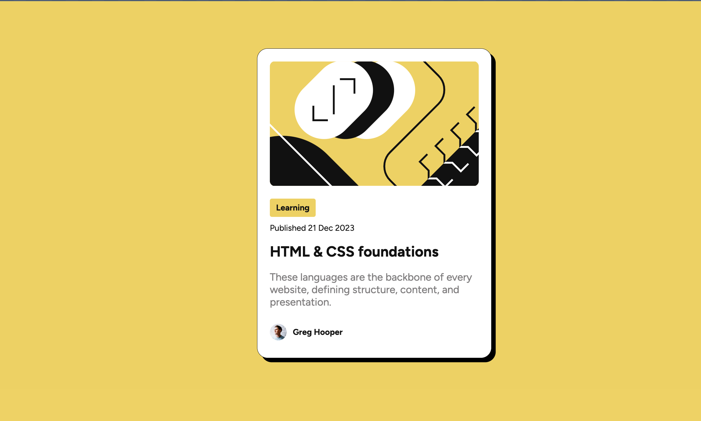
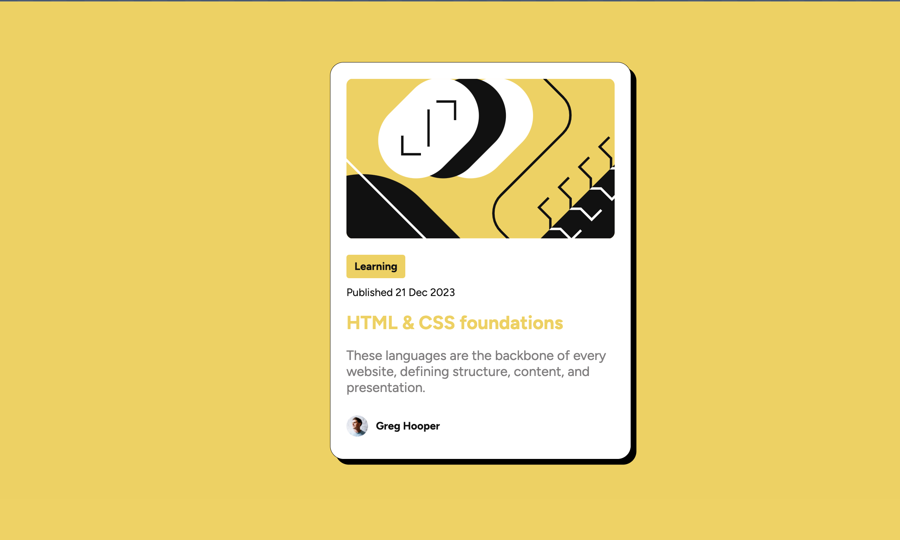

# Frontend Mentor - Blog preview card solution

This is a solution to the [Blog preview card challenge on Frontend Mentor](https://www.frontendmentor.io/challenges/blog-preview-card-ckPaj01IcS). Frontend Mentor challenges help you improve your coding skills by building realistic projects.

## Table of contents

- [Overview](#overview)
  - [The challenge](#the-challenge)
  - [Screenshot](#screenshot)
  - [Links](#links)
- [My process](#my-process)
  - [Built with](#built-with)
  - [What I learned](#what-i-learned)
  - [Continued development](#continued-development)
  - [Useful resources](#useful-resources)
- [Author](#author)
- [Acknowledgments](#acknowledgments)

**Note: Delete this note and update the table of contents based on what sections you keep.**

## Overview

### The challenge

Users should be able to:

- See hover and focus states for all interactive elements on the page

### Screenshot

### Links

- Solution URL: 
- Live Site URL: [Live Site](mentorcardpreview.netlify.app)

## My process

### Built with

- Semantic HTML5 markup
- CSS Selectors
- Flexbox
- CSS Grid
- Media Queries
- Imported Font
- Relative and absolute sizes

### What I learned

What I learned was how to import a downloaded font and use it in the design, also how to use HSL for color and that shadows can give that more aesthetic touch.

### Continued development

I would like to continue learning about HSL and master it because it is a more efficient way to use colors,

### Useful resources

- [Load and Use Fonts](https://www.digitalocean.com/community/tutorials/how-to-load-and-use-custom-fonts-with-css) - This resource helped me to remember the ways to use fonts in css, including importing them from downloaded files, the article is very interesting and practical.

## Author

- Frontend Mentor - [@jejorm](https://www.frontendmentor.io/profile/jejorm)

- GitHub - [@jejorm](https://github.com/Jejorm)
